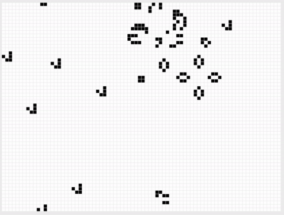

# Game of Life

Based on John Conway's Game of Life. I recreated the game using vanilla Javascript.

[Live demo](https://gameoflife-jeffdelara.netlify.app/)

Life’s simple, elegant rules give rise to astonishingly complex emergent behavior. It is played on a 2-D grid. Each square in the grid contains a cell, and each cell starts the game as either “alive” or “dead”. Play proceeds in rounds. During each round, each cell looks at its 8 immediate neighbors and counts up the number of them that are currently alive.

## How to Play

Create your own cell automaton by drawing on the grid (like pixel graphics). Once you are satisfied with your work, click `Run` and let your creations come to life. Discover different patterns.

## Rules 

+ Any live cell with 0 or 1 live neighbors becomes dead, because of underpopulation
+ Any live cell with 2 or 3 live neighbors stays alive, because its neighborhood is just right
+ Any live cell with more than 3 live neighbors becomes dead, because of overpopulation
+ Any dead cell with exactly 3 live neighbors becomes alive, by reproduction
